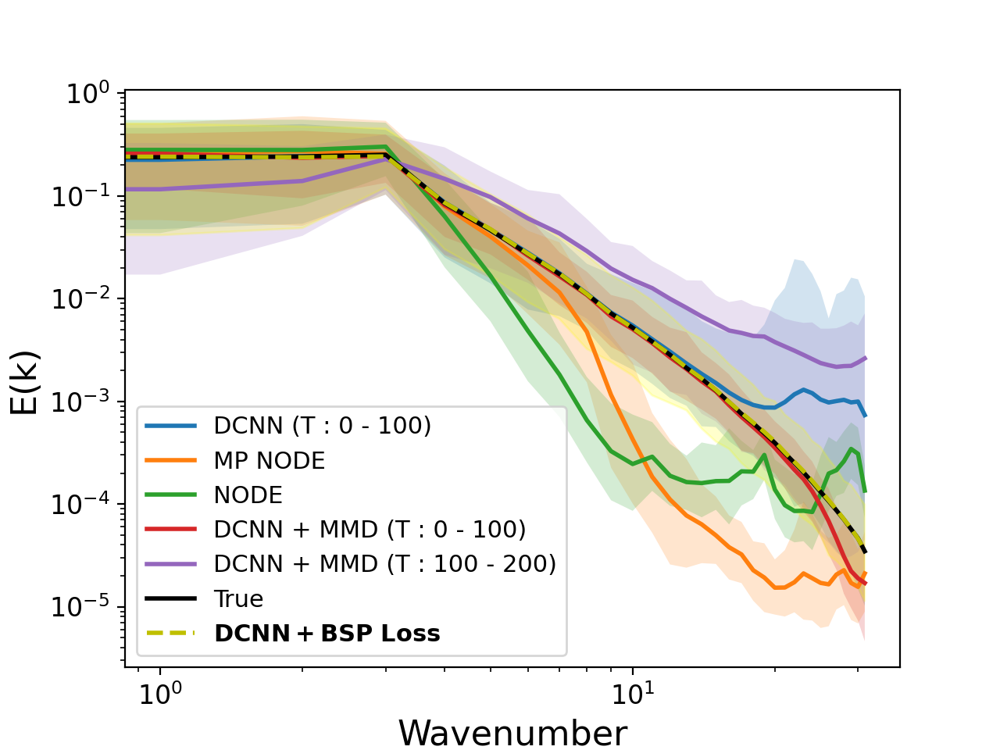
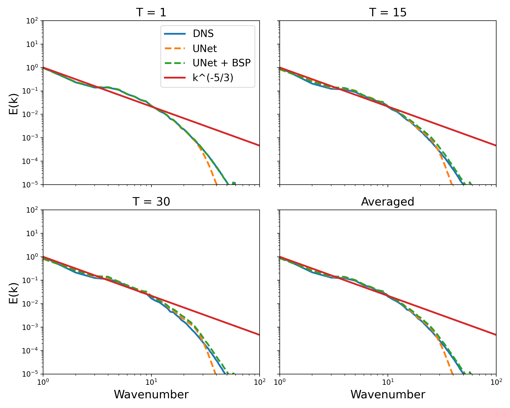

# Binned Spectral Power Loss

This repository provides a sample usage code for the paper:

Chakraborty, D., Mohan, A. T., & Maulik, R. (2025). *Binned spectral power loss for improved prediction of chaotic systems*. arXiv preprint arXiv:2502.00472.

It includes both JAX and PyTorch implementations (`bsp_jax.py` and `bsp_torch.py`). It also has a sample datapipe and training script.

Some parts may contain slight modifications based on target applications.

## Results

2D turbulence case :

3D turbulence case:

These plots are using the bsp loss function